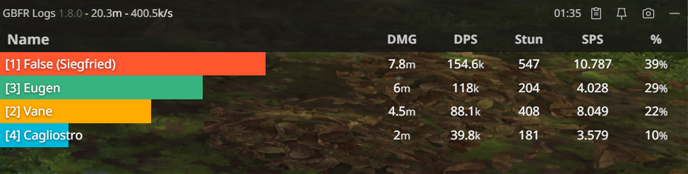

# gbfr-logs

Experimental overlay DPS meter for Granblue Fantasy: Relink, based on the reverse engineering work from [naoouo/GBFR-ACT](https://github.com/nyaoouo/GBFR-ACT).

## Screenshots

## How to install

- Go to [Releases](https://github.com/false-spring/gbfr-logs/releases)
- Download the latest .msi installer and run it.
- Open GBFR Logs after the game is already running.

## Known Issues

- DoT skills do not count towards damage.

## Frequently Asked Questions

> Q: The meter isn't updating or displaying anything.

Try running the program after the game has been launched. Be sure to run the program as admin.

> Q: Is this safe? My antivirus is marking the installation as a virus / malware.

You can ignore these as false positives.

- GBFR Logs does code injection into the running game process which can look like a virus-like program.
- GBFR Logs reads game memory and initializes code hooks in order to receive damage data.
- I recommend adding an exception / whitelisting for the installation folder for the best experience, but you may not need to do so if you haven't ran into this issue.

Windows Defender: https://support.microsoft.com/en-us/windows/add-an-exclusion-to-windows-security-811816c0-4dfd-af4a-47e4-c301afe13b26

> Q: How do I update?

Same as with installing, you can download the [latest release](https://github.com/false-spring/gbfr-logs/releases) and run the installer again and it will update over your old installation.

> Q: How do I uninstall?

You can uninstall GBFR Logs the normal way through the Control Panel or by running the uninstall script in the folder where you installed it to. You may also want to remove these folders.

- `%AppData%\gbfr-logs`

> Q: My issue isn't listed here, or I have a suggestion.

Feel free to create a [new GitHub issue](https://github.com/false-spring/gbfr-logs/issues) or look for the GBFR Logs thread on [Discord](https://discord.gg/gbsG4CDsru)

## For Developers

- Install nightly Rust ([rustup.rs](https://rustup.rs/)) + [Node.js](https://nodejs.org/en/download).
- Install NPM dependencies with `npm install`
- `npm run tauri dev`

## Under the hood

This project is split up into a few subprojects:

- `src-hook/` - Library that is injected into the game that broadcasts essential damage events.
- `src-tauri/` - The Tauri Rust backend that communicates with the hooked process and does parsing.
- `protocol/` - Defines the message protocol used by hook + back-end.
- `src/` - The JS front-end used by the Tauri web app

## TODO

Core functionality:

- Track skill breakdown, min/max damage.
- Track damage per target
- Provide translations for skills
- DPS charting
- Historical encounter logs

Improvements:

- Hotkey shortcuts
- Toggle clickthrough
- Configuration / Settings
- Track player index in party (for distinguising between duplicate charas)
- Multiple language support (can pull some from translation files, but skill names are manual)

Reverse Engineering:

- Figure out if we can fetch party data upon area enter, would make it easier to cache it then.
- Flags for damage cap tracking, if they exist.
- Buff tracking
